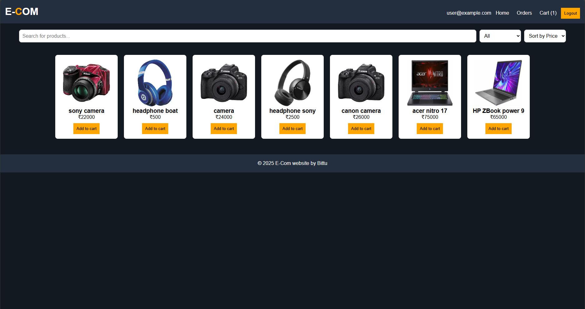

## 🛍️ E-COM: Firebase-Powered E-Commerce Website

> 🚀 A sleek, fully functional e-commerce web app with **admin panel**, **user authentication**, **cart**, **checkout**, and **order history**—powered by Firebase.



<!-- Optional: Replace with an actual screenshot of your app later -->

---

### 📦 Features

* 🧑‍💼 **Admin Panel**

  * Add/edit/delete products
  * Category support (Headphones, Camera, Laptop)

* 🛒 **User Side**

  * Register/Login with Firebase Auth
  * Browse products
  * Add to cart, update quantity, remove items
  * Checkout with address input

* 📜 **Order Management**

  * Orders saved in Firebase Firestore
  * Order history tied to logged-in users

* 🌐 **Tech Stack**

  * HTML + CSS + JavaScript (Vanilla)
  * Firebase Auth + Firestore (v11.9.1)

---

### 🔧 Setup Instructions

1. **Clone the repo**

```bash
git clone https://github.com/your-username/ecom-firebase.git
cd ecom-firebase
```

2. **Firebase Setup**

   * Go to [Firebase Console](https://console.firebase.google.com/)
   * Create a project
   * Enable **Authentication (Email/Password)**
   * Enable **Firestore Database**
   * Add your web app & copy config

3. **Replace `firebase-config.js`**

```js
// js/firebase-config.js
export const firebaseConfig = {
  apiKey: "YOUR_API_KEY",
  authDomain: "YOUR_DOMAIN",
  projectId: "YOUR_PROJECT_ID",
  ...
};
```

4. **Open `index.html` in your browser and explore!**

---

### 📂 Folder Structure

```
📁 css/
📁 js/
📄 index.html
📄 admin.html
📄 cart.html
📄 checkout.html
📄 userLogin.html
📄 userSignup.html
```

### 🤖 Made With

* ❤️ Passion for clean code
* ☕ Late nights + Red Bull
* ⚙️ Firebase & JavaScript

---

### 📢 Credits

Built with 💻 by **BittXP**

> Feel free to fork, contribute, or ⭐️ if you like the project!

